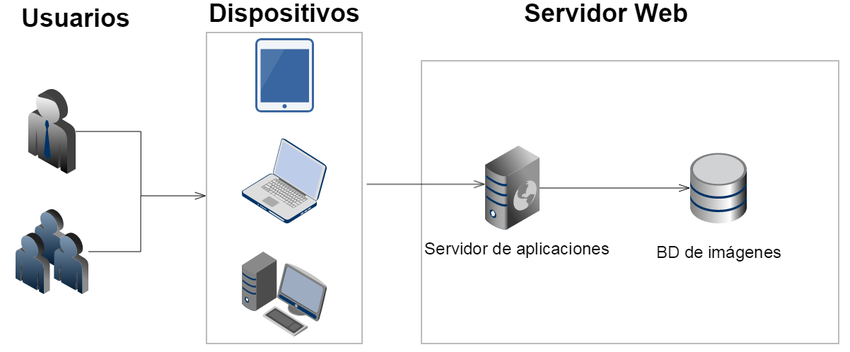
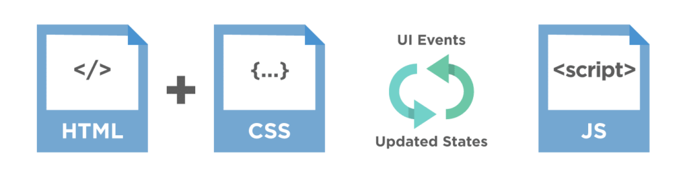

# Conceptos Básicos de Desarrollo Web y Arquitectura Cliente-Servidor

## 1. Introducción al Desarrollo Web

El desarrollo web se refiere a la creación y mantenimiento de sitios web y aplicaciones web. Involucra varias tecnologías, herramientas y lenguajes de programación que se utilizan para desarrollar la interfaz de usuario (Frontend) y la lógica del servidor (Backend). Vamos a ver algunos conceptos básicos.

## 2. Arquitectura Cliente-Servidor

La arquitectura cliente-servidor es un modelo de diseño de software que divide las responsabilidades de un sistema en dos partes. Este modelo se basa en la comunicación y sus componentes son:

- **Cliente**: Es el dispositivo con el que interactua el usuario, normalmente un navegador web, que solicita recursos, información o servicios al servidor. El cliente se encarga de presentar la interfaz de usuario y gestionar la interacción del usuario con el sistema.

- **Servidor**: Es el sistema que procesa las solicitudes del cliente y responde con los recursos o servicios solicitados, como páginas HTML, datos JSON, imágenes, etc. El servidor maneja la lógica de negocio, almacenamiento de datos y otro tipos de operaciones.

 

A grandes rasgos, el flujo de comunicación en una arquitectura cliente-servidor es:

1. El cliente envía una solicitud al servidor a través de la web en este caso.
2. El servidor procesa la solicitud, accede a la base de datos si es necesario, y envía una respuesta al cliente.
3. El cliente recibe la respuesta y maneja los datos o los procesa para presentarselos al usuario.

## 3. Lenguajes que Entiende el Navegador

El navegador web (cliente) es capaz de interpretar y ejecutar lenguajes de programación y marcado, que son esenciales para construir aplicaciones web:

- **HTML (Hypertext Markup Language)**: Es un lenguaje de marcado o de maquetado que se utiliza para crear páginas web. Define la estructura y el contenido de una página web a través de ciertos elementos.
- **CSS (Cascading Style Sheets)**: Es un lenguaje de estilo que describe cómo se deben presentar los elementos HTML en la pantalla. Permite aplicar colores, fuentes, espaciados, y otros estilos visuales a las páginas web.

- **JavaScript (JS)**: Es un lenguaje de programación que permite añadir interactividad y funcionalidades dinámicas a las páginas web. Se ejecuta en el navegador y puede manipular el HTML y CSS, gestionar eventos, interactuar con APIs, entre otras funcionalidades.

