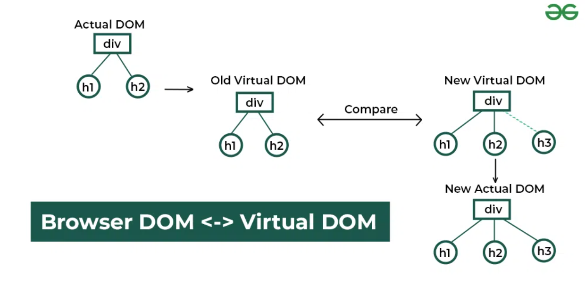

# ¿Qué es React?

React es una **biblioteca** de JavaScript diseñada para construir interfaces gráficas de usuario de manera eficiente y modular. Fue creada por Facebook (ahora Meta) y es ampliamente utilizada en el desarrollo de aplicaciones web interactivas.

React se basa en un concepto central: los **componentes**. Estos componentes permiten dividir la interfaz de usuario en piezas reutilizables e independientes. Originalmente, los componentes en React se implementaban principalmente como **clases**. Sin embargo, con la introducción de los **hooks** en React 16.8, los componentes **funcionales** han ganado popularidad y ahora son el enfoque preferido en el desarrollo moderno. Los componentes de clase todavía se usan en proyectos más antiguos, pero hoy en día la mayoría de las aplicaciones usan componentes funcionales.

Aunque React se puede usar para construir cualquier tipo de interfaz, su enfoque principal es crear **SPAs** (**Single Page Applications**). En una SPA, toda la aplicación se carga en una única página HTML. A medida que el usuario navega por la aplicación, React actualiza el contenido dinámicamente, sin necesidad de recargar toda la página. Esto mejora la experiencia del usuario, ofreciendo transiciones rápidas y fluidas entre vistas.

El núcleo de una aplicación React generalmente se ejecuta en un único archivo HTML que contiene un punto de entrada donde React "monta" el árbol de componentes.

# ¿Cómo funciona React?

El concepto clave detrás de React es el **Virtual DOM**. Este es una representación ligera del **DOM** (Document Object Model) real del navegador, que se mantiene en memoria.

Cuando ocurre un cambio en la aplicación, React no actualiza inmediatamente el DOM real. En su lugar, actualiza el **Virtual DOM**, compara los cambios con el estado anterior (proceso llamado "reconciliación") y determina la manera más eficiente de aplicar estos cambios en el DOM real. Esta estrategia minimiza el número de operaciones costosas en el DOM y mejora el rendimiento de la aplicación.



## Flujo de trabajo de React:

1. **Cambio de Estado**: Se produce un cambio en el estado de algún componente.
2. **Cómputo de cambios**: React compara el Virtual DOM actualizado con la versión anterior y detecta qué partes del DOM han cambiado.
3. **Actualización del DOM real**: React actualiza el DOM real solo en las partes que han cambiado, mejorando la eficiencia y evitando renderizados innecesarios.

# JSX (JavaScript XML)

**JSX** es una extensión de la sintaxis de JavaScript que permite escribir código similar a HTML dentro de JavaScript. No es un lenguaje separado, sino una forma más amigable de escribir estructuras de componentes en React. Antes de ser interpretado por el navegador, JSX es transformado en JavaScript puro mediante un **transpilador** como Babel.

En el contexto de React, JSX permite escribir la estructura de los componentes (similar a HTML) y la lógica en un único archivo, lo que mejora la legibilidad y facilita el desarrollo.

## Reglas y Convenciones en JSX:

1. **Devuelve Siempre un Único Elemento Root**: En JSX, debes retornar un solo elemento raíz. Si tienes varios elementos, deben estar envueltos en un contenedor (como un `<div>` o un `<Fragment>`).

   **Correcto**:

   ```jsx
   return (
     <div>
       <h1>Hello World!</h1>
       <p>This is my first React component.</p>
     </div>
   );
   ```

   **Incorrecto**:

   ```jsx
   return (
     <h1>Hello World!</h1>
     <p>This is my first React component.</p>
   );
   ```

2. **Utiliza `className` en lugar de `class`**: En JSX, `class` es una palabra reservada en JavaScript, por lo que para definir clases CSS debes utilizar `className`.

   ```jsx
   <div className="container">Hello World</div>
   ```

3. **Expresiones de JavaScript en JSX**: Para mostrar variables o resultados de expresiones JavaScript, usa llaves `{}`.

   **Correcto**:

   ```jsx
   <div>{myVariable}</div>
   ```

   **Incorrecto**:

   ```jsx
   <div>myVariable</div>
   ```

4. **Atributos en camelCase**: Los nombres de atributos en JSX (como eventos o propiedades CSS) deben escribirse en **camelCase**.

   ```jsx
   <button onClick={handleClick}>Click me</button>
   ```
