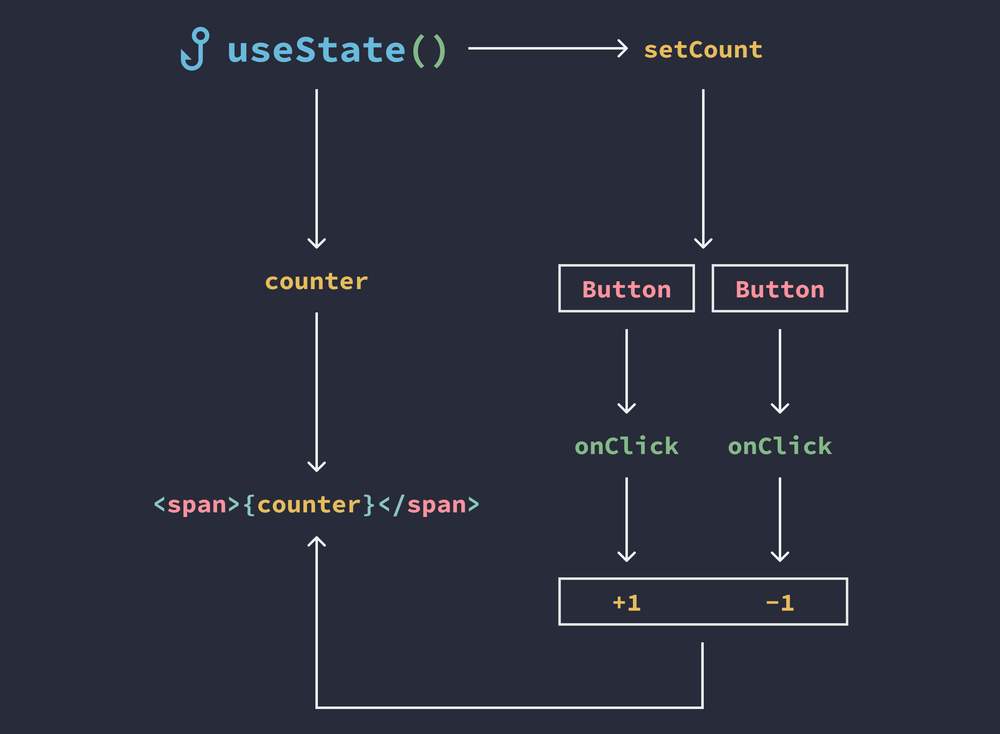

# Hooks en React

Los **hooks** en React son funciones que permiten a los componentes **funcionales** trabajar con el **estado** y el **ciclo de vida** de los componentes, algo que anteriormente solo era posible en componentes de clase. Los hooks hacen que los componentes funcionales sean mucho más potentes y flexibles.

## Tipos de Hooks

1. **Hooks Predefinidos**: Son los hooks que vienen integrados con React, como `useState`, `useEffect`, `useContext`, entre otros.
2. **Custom Hooks**: Son hooks personalizados creados por los desarrolladores. Permiten **reutilizar lógica** de estado y ciclo de vida entre diferentes componentes, agrupando funcionalidades comunes.

## Ciclo de Vida de un Componente en React

Todos los componentes en React pasan por un **ciclo de vida**, que define cómo reaccionan al ser creados, actualizados o eliminados de la pantalla. Este ciclo se puede gestionar fácilmente con hooks como `useEffect`.

1. **Montaje (Mounting)**: El componente se monta cuando se agrega a la pantalla por primera vez.
2. **Actualización (Updating)**: El componente se actualiza cuando recibe nuevas **props** o su **estado** cambia, generalmente como respuesta a una interacción del usuario.
3. **Desmontaje (Unmounting)**: El componente se desmonta cuando se remueve de la pantalla.

## `useState`: Manejo del Estado en Componentes Funcionales

El hook **`useState`** permite a los componentes funcionales tener su propio **estado** interno. Es uno de los hooks más utilizados en React. En lugar de definir el estado en una clase, `useState` proporciona una forma sencilla de agregar y actualizar el estado en componentes funcionales.

## Props vs Estado

- **Props**: Son valores que un componente recibe de su **componente padre**. Son inmutables dentro del componente hijo.
- **Estado**: Es información que un componente maneja y puede modificar de manera local. El estado es mutable, lo que significa que puede cambiar con el tiempo.

## Convención de Uso de `useState`

El hook `useState` devuelve un **array con dos elementos**: el valor del estado y una función para actualizar ese valor. Usualmente, se utilizan nombres de variables con desestructuración, como `[algo, setAlgo]`.

```javascript
const [count, setCount] = useState(0);
```

El valor inicial del estado puede pasarse como argumento dentro de `useState`.

## Ejemplo:

```javascript
import React, { useState } from "react";

const MyComponent = () => {
  const [count, setCount] = useState(0);

  return (
    <div>
      <p>Counter: {count}</p>
      <button onClick={() => setCount(count + 1)}>Increment</button>
    </div>
  );
};

export default MyComponent;
```

En este ejemplo, el componente tiene un contador (`count`) que se incrementa cada vez que el usuario hace clic en el botón.



## `useEffect`: Efectos Secundarios y Ciclo de Vida

El hook **`useEffect`** permite **sincronizar** el componente con algún sistema externo o manejar efectos secundarios en tus componentes funcionales. Se ejecuta después de que el componente ha renderizado y puede ser utilizado para tareas como:

- **Peticiones HTTP**.
- **Suscripciones**.
- **Manipulación del DOM**.
- **Limpieza de efectos (cleanup)** al desmontar el componente.

## Cómo Funciona `useEffect`

El hook `useEffect` toma una **función** como argumento que se ejecutará **después** de cada renderización. Esta función se ejecuta en tres situaciones principales:

1. **Montaje**: La primera vez que el componente se renderiza.
2. **Actualización**: Cada vez que se actualiza el estado o recibe nuevas props.
3. **Desmontaje**: Se puede especificar una función de limpieza que se ejecuta cuando el componente se desmonta.

## Ejemplo Básico:

```javascript
import React, { useEffect } from "react";

function Example() {
  useEffect(() => {
    console.log("Component rendered or updated");
  });

  return <span>This is a useEffect example</span>;
}
```

En este ejemplo, `useEffect` se ejecuta en **cada renderización**. Cada vez que el componente `Example` se renderiza, ya sea por un cambio en el estado o las props, se imprime el mensaje en la consola.

## Ejecución Condicional en `useEffect`

Puedes hacer que `useEffect` se ejecute solo cuando ciertas variables cambien, utilizando un **array de dependencias** como segundo argumento. Esto es útil para optimizar la ejecución de efectos y evitar renderizados innecesarios.

```javascript
useEffect(() => {
  console.log("Only when count state changes");
}, [count]); // Solo se ejecuta cuando 'count' cambia
```

## Limpiar Efectos (Cleanup)

Si el efecto necesita limpiar recursos, como eliminar un **event listener** o cancelar una **suscripción**, puedes devolver una función de limpieza en `useEffect`. Esta función se ejecutará antes de que el componente se **desmonte** o cuando el efecto se vuelva a ejecutar debido a un cambio en sus dependencias.

```javascript
useEffect(() => {
  const handleResize = () => console.log("window resized");
  window.addEventListener("resize", handleResize);

  return () => {
    window.removeEventListener("resize", handleResize); // Cleanup
  };
}, []); // El efecto solo se ejecuta en el montaje y desmontaje
```

## Otros Hooks:

- **useContext**: Acepta un objeto de contexto, el valor devuelvo por React.createContext, posteriormente devuelve el valor de contexto actual para ese contexto en concreto.
- **useReducer**: Para manejar estados complejos y transiciones de estado. Una alternativa a useState.
- **useCallback**: Devuelve una función callback que se memoriza y que solo cambia si cambia una dependencia del árbol de dependencias.
- **useMemo**: Devuelve un valor memorizado.
- **useRef**: Devuelve un objeto ref mutable. El objeto devuelto estará disponible durante toda la vida útil del componente.
- **useLayoutEffect**: Es idéntico a useEffect, pero se detona sincrónicamente después de todas las mutaciones del DOM.
